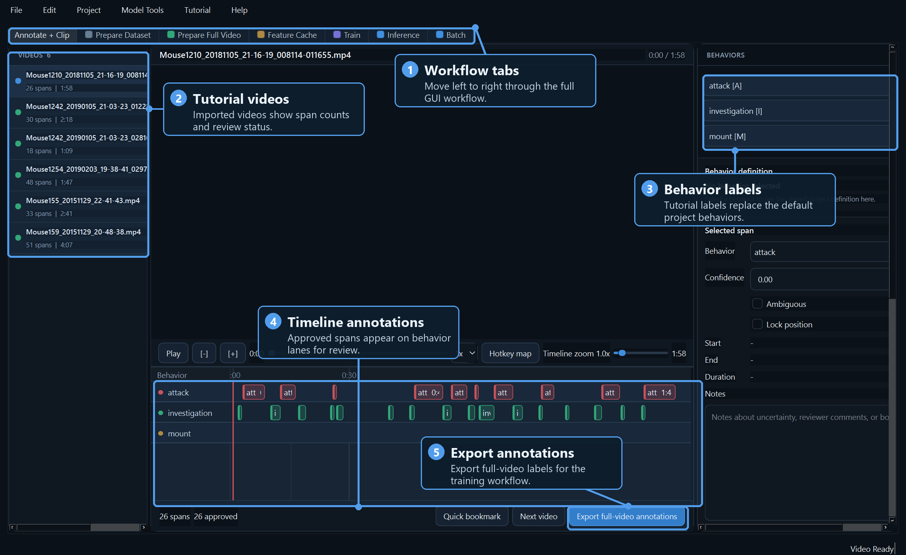
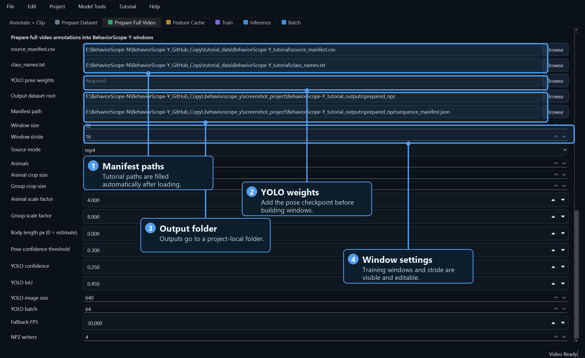
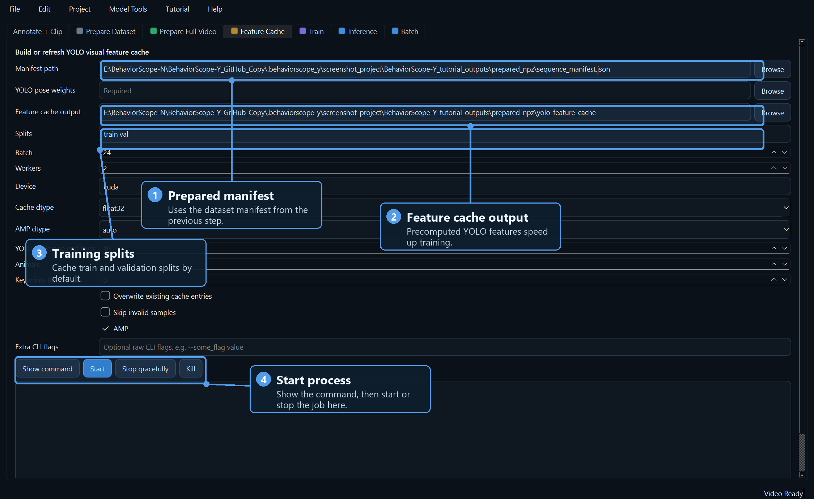
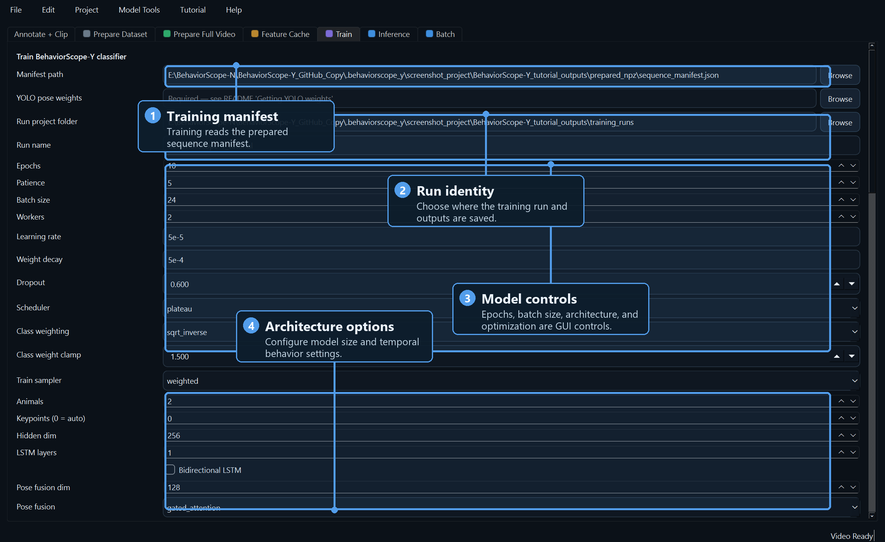
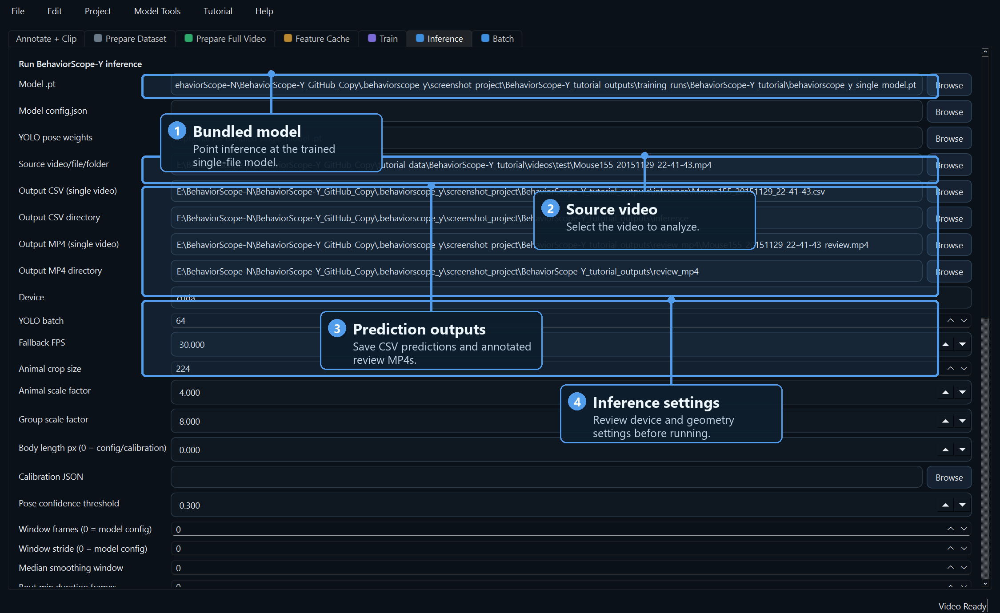
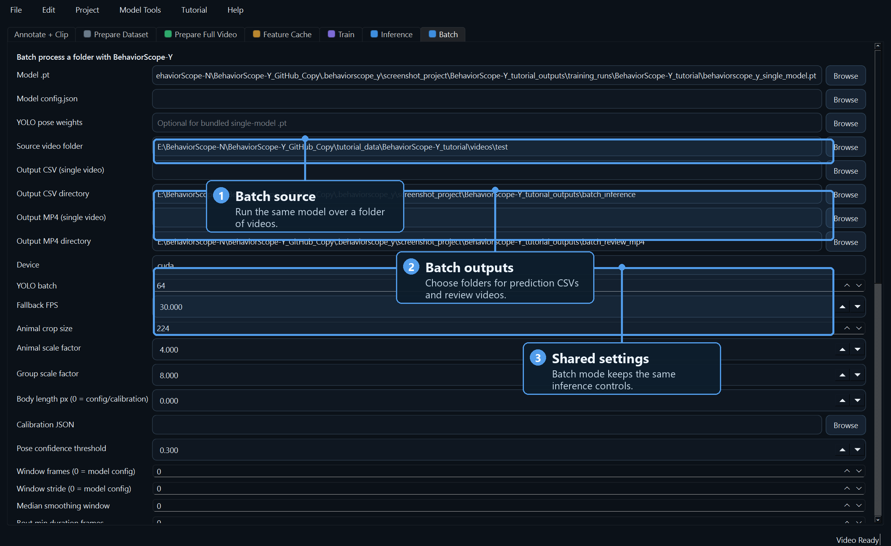

# BehaviorScope-X

BehaviorScope-X is a desktop application for building animal behavior classifiers from video. It combines pose estimation, cached visual descriptors, and temporal behavior models so researchers can annotate videos, train classifiers, and inspect behavior predictions from a single validated GUI workflow surface.

The application is organized as a pose-model-flexible system: users choose a supported pose workflow, build compatible sequence and feature caches, and train the same downstream temporal behavior classifier. The validated workflow families are YOLO-pose, MobileNetV3, and DeepLabCut-HRNet.

The application supports the full path from raw videos to reviewable predictions:

- import and annotate videos,
- assign videos to train, validation, and held-out test splits,
- prepare full-video training windows,
- extract pose-backbone visual descriptors,
- train a temporal behavior classifier,
- evaluate validation and held-out performance,
- run bundled YOLO-backed inference on one video or a folder of videos,
- create model-agnostic ethogram and bout summaries from temporal prediction CSVs,
- export prediction CSVs and annotated review MP4s where the workflow supports review-video rendering.

Command-line scripts are included for automation and reproducible batch runs, but the recommended starting point is the Qt GUI.

## Quick Start

```bash
python -m venv .venv
.venv\Scripts\activate
pip install -r requirements.txt
python behaviorscope_x_qt.py
```

For GPU training, install the CUDA build of PyTorch before installing the remaining dependencies:

```bash
pip install torch torchvision --index-url https://download.pytorch.org/whl/cu121
pip install -r requirements.txt
```

`ffmpeg` is recommended for video conversion and some export workflows.

## Requirements

- Python 3.10 or newer is recommended.
- A supported pose checkpoint for the target animal/video setup. The GUI
  supports YOLO-pose and MobileNetV3 window-cache construction directly; DLC
  workflows use a DeepLabCut project and checkpoints.
- Videos readable by OpenCV/Qt, such as `.mp4`.
- An NVIDIA GPU is recommended for training and faster inference.
- MobileNetV3 comparison workflows require the MobileNetV3 pose checkpoint and the optional classical-baseline dependencies.
- DeepLabCut-HRNet workflows require a working DeepLabCut 3 environment and a DLC-format project.

## GUI Workflow

Launch the application:

```bash
python behaviorscope_x_qt.py
```

The main tabs are organized by annotation and model family. Each model-family tab is an independent path into the same BehaviorScope cache, classifier, evaluation, and output structure:

- `Annotate + Clip`: import videos, annotate behavior spans, review labels, and export full-video annotation manifests.
- `YOLO-pose`: build clip or full-video caches, precompute YOLO visual features, train/evaluate the temporal classifier, run single-video inference, run batch inference, create ethograms/bout summaries, and inspect output artifacts.
- `MobileNetV3`: launch the MobileNetV3 full-video cache, visual-feature cache, neural classifier, static-baseline, held-out evaluation, ethogram/bout summary, and suite-summary stages.
- `DeepLabCut-HRNet`: launch DLC SuperAnimal pose/detector fine-tuning, DLC top-down cache generation, HRNet visual-feature cache extraction, classifier training, held-out cache generation, held-out evaluation, ethogram/bout summary, and output inspection.

After a step completes successfully, the GUI fills the next tab's paths where possible.

YOLO-pose, MobileNetV3, and DeepLabCut-HRNet all expose the same model-agnostic `Ethograms + Bouts` panel because ethograms are generated from temporal behavior predictions, not from one pose backbone. YOLO-pose and MobileNetV3 expose direct GUI panels for full-video cache construction, feature-cache generation, and classifier training. DeepLabCut-HRNet uses staged runners because it depends on a DLC project, top-down detector/pose checkpoints, and longer external-library steps. Use `plan` first in staged runners to inspect commands before starting long GPU jobs.

## Documentation Site

Detailed workflow documentation is available under `docs/` and can be served with MkDocs:

```bash
mkdocs serve
```

The documentation covers installation, annotation, YOLO-pose, MobileNetV3, DeepLabCut-HRNet, feature taps, outputs, provenance, and troubleshooting.

## GUI Screenshots

The screenshots below show the main GUI workflow with annotated callouts for new users. The image files are stored in `docs/screenshots/annotated/` so GitHub can render them directly from the repository.

### Annotation Workspace



### Full-Video Cache



### Feature Cache



### Train



### Inference



### Batch Inference



## Tutorial Dataset

BehaviorScope-X includes a guided tutorial based on a small MARS mouse-behavior subset. In the GUI, choose:

```text
Tutorial > Download/Load BehaviorScope-X tutorial...
```

The tutorial loader downloads or locates the tutorial data, imports the videos, adds behavior labels, assigns train/validation/test splits, converts `.annot` files into timeline annotations, and fills the downstream workflow paths.

If the automatic download fails, manual download instructions are available in [`tutorial_data/README.md`](tutorial_data/README.md).

Some tutorial folders and saved-model schema fields retain the earlier `BehaviorScope-Y` working name for compatibility with existing tutorial manifests and checkpoints. The GUI, documentation, package metadata, and manuscript-facing public name are `BehaviorScope-X`.

## Annotation And Splits

The annotation workspace supports:

- importing individual videos or folders,
- creating and editing behavior spans on a timeline,
- marking spans as draft, ready, approved, or rejected,
- locking reviewed spans,
- assigning videos to `train`, `val`, `test`, or `exclude`,
- exporting full-video annotations for training.

For full-video training, use:

```text
Project > Export full-video annotations...
```

Legacy clip extraction remains available from the Project menu, but full-video annotation export is the recommended training path.

## YOLO-Backed Model Bundling

YOLO-backed BehaviorScope-X inference uses two model components:

- a YOLO-pose model for detection, keypoints, and visual feature extraction,
- a temporal classifier for behavior prediction.

Training can export a bundled `.pt` file containing both components. Existing classifier and YOLO-pose checkpoints can also be bundled from the GUI:

```text
Model Tools > Bundle existing classifier + YOLO...
```

The bundled model is the preferred YOLO-pose inference format because users do not need to manage separate classifier, config, and YOLO paths. MobileNetV3 and DeepLabCut-HRNet workflows produce temporal prediction outputs through their feature-cache and evaluation runners; their ethograms are generated from those prediction CSVs.

## Inference Outputs

YOLO-backed inference can produce:

- behavior prediction CSV files,
- smoothed per-frame outputs,
- runtime metrics,
- optional pose exports,
- annotated review MP4s.

Review MP4s make it easier to inspect predictions visually and share model outputs with collaborators.

All temporal model-family workflows can feed the `Ethograms + Bouts` tab once prediction CSVs are available.

## Command-Line Use

The GUI is the recommended entry point. The CLI remains useful for scripted runs, remote machines, and reproducible experiments.

Prepare full-video training windows:

```bash
python prepare_full_video_npz.py ^
  --source_manifest_csv path\to\source_manifest.csv ^
  --class_names_file path\to\class_names.txt ^
  --yolo_weights path\to\yolo_pose_best.pt ^
  --output_root runs\my_dataset_npz ^
  --validate_manifest
```

Train and export a bundled model:

```bash
python train_x.py ^
  --manifest_path runs\my_dataset_npz\sequence_manifest.json ^
  --yolo_weights path\to\yolo_pose_best.pt ^
  --auto_feature_cache ^
  --sequence_model lstm ^
  --project runs ^
  --name my_behavior_model ^
  --export_single_model
```

Run inference:

```bash
python infer_x.py ^
  --model_path runs\my_behavior_model\behaviorscope_x_single_model.pt ^
  --source path\to\video.mp4 ^
  --output runs\my_behavior_model\inference_outputs\video.behavior.csv ^
  --output_video runs\my_behavior_model\inference_outputs\video.annotated.mp4
```

## Repository Layout

- `behaviorscope_x_qt.py`: Qt GUI launcher.
- `annotation_app/`: GUI application code.
- `prepare_full_video_npz.py`: full-video dataset preparation.
- `precompute_visual_features_x.py`: YOLO feature-cache generation.
- `train_x.py`: behavior classifier training.
- `infer_x.py`: inference and review-video export.
- `package_single_model_x.py`: single-file model bundling.
- `analysis_workflows/mobilenetv3_backbone/`: MobileNetV3 analysis runner and configuration.
- `analysis_workflows/dlc_superanimal_topdown/`: DeepLabCut-HRNet analysis runner, support scripts, and configuration.
- `analysis_workflows/shared_analysis_code/`: shared controlled-comparison, classical-baseline, and Fly-v-Fly helpers used by the model-family runners.
- `docs/screenshots/`: reusable raw and annotated GUI screenshots for documentation.
- `tutorial_data/`: tutorial metadata and local tutorial cache.

## Data License

The tutorial media and annotations are derived from MARS data and are distributed under `CC BY-NC 4.0` terms with attribution. The tutorial dataset is separate from the software license.

## License

BehaviorScope-X source code is licensed under the GNU Affero General Public License v3.0. See [`LICENSE`](LICENSE) for the full license text.


